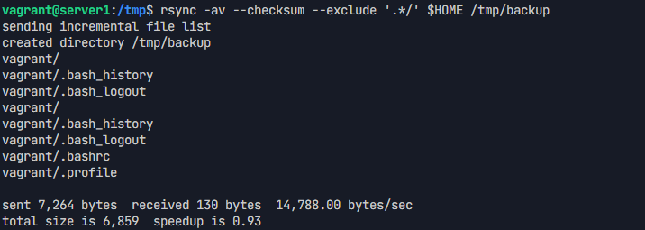
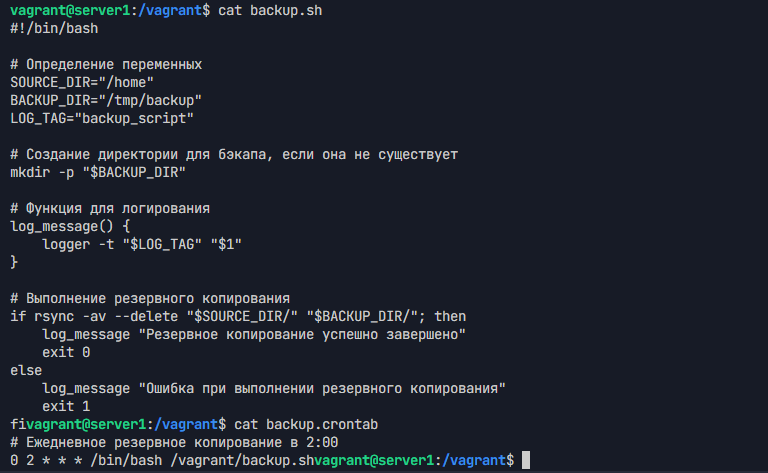

# Домашнее задание к занятию 3 «Резервное копирование»

## Задание 1

### Задача

Составьте команду rsync, которая позволяет создавать зеркальную копию домашней директории пользователя в директорию `/tmp/backup` со следующими требованиями:

- Исключить из синхронизации все директории, начинающиеся с точки (скрытые)
- Обеспечить подсчет хэш-сумм для всех файлов, даже если их время модификации и размер идентичны в источнике и приемнике

### Решение

Используемая команда:
```bash
rsync -av --checksum --exclude '.*/' $HOME /tmp/backup
```

Результат выполнения:



## Задание 2

### Задача

Настроить регулярное резервное копирование домашней директории пользователя со следующими требованиями:

- Использовать rsync и cron для автоматизации
- Создавать полностью зеркальную резервную копию
- Выполнять копирование раз в день
- Обеспечить логирование результатов операции в системный лог
- Размещать резервную копию локально в директории `/tmp/backup`

### Решение

Результат настройки cron и выполнения резервного копирования:



Содержимое файла конфигурации находится в [`backup.crontab`](backup.crontab)